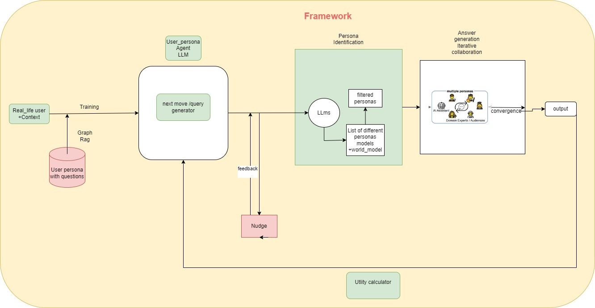

# Automated Personalized Nudge Pushing System

## Table of Contents

- [About the Project](#about-the-project)
- [Installation](#installation)
- [Usage](#usage)
- [License](#license)
- [Contact](#contact)

---

## About the Project

This repository contains the implementation of a **Nudge Pushing System** designed to help employees stay focused on their short-term goals through data-driven insights. The system combines **user persona mapping**, **dynamic query generation**, and **multi-agent collaboration** to deliver personalized nudges based on employee data.

## Steps

- **User Persona Mapping**:  
  Each employee is mapped to a predefined persona stored in the database, created using segmentation techniques similar to customer segmentation. This mapping helps in providing personalized analyses and insights relevant to the employee.

- **Query Generator**:  
  The system includes a Query Generator that takes the attributes of the mapped persona and generates SQL queries. These queries can be direct or trigger additional follow-up questions. The LangGraph React Agent and SQL Toolkit are used to dynamically generate these SQL queries and find insights and tricker question could be generated.For now , query could be evaluated using Selfcheck gpt.

- **Knowledge Graph Support (Neo4j)**:  
  For Future iterations , project will incorporate Neo4j Knowledge Graphs for deeper data exploration and relationship analysis.

- **Autogen Collaborative Framework**:  
   we integrated a multi-agent system for department-specific analysis (HR, Sales, Finance). Each agent will utilize Retrieval-Augmented Generation (RAG), allowing for more comprehensive and focused insights. Fine-tuning will enable more precise nudging based on department needs.

- **Nudge Timing Optimization**:  
  The system is currently being optimized to determine the best times to push nudges to employees, ensuring they are delivered at moments that maximize their impact.

## Installation

1. Clone the repository:
   ```bash
   git clone https://github.com/yourusername/nudge-pushing-system.git
   cd nudge-pushing-system

# Query Generation


# Multi Agent System


### Built With

- **SQL** (Northwind Database)
- **LangGraph React Agent**
- **SQL Toolkit**
- **Neo4j Knowledge Graphs** (for future iterations)
- **Retrieval Augmented Generation (RAG)**
- **Autogen Collaborative Framework**


---

## Installation

To install and run this project locally, follow these steps:

1. Clone the repo:
    ```bash
    git clone https://github.com/agrawalsnehal327/Decision_point_Analytics.git
    ```

2. Install dependencies:
    ```bash
    pip install -r requirements.txt
    ```

---

## References
[https://arxiv.org/pdf/2305.14930.pdf](https://arxiv.org/pdf/2305.14930.pdf)
[https://arxiv.org/pdf/2310.18168.pdf](https://arxiv.org/pdf/2310.18168.pdf)

## Usage

Explain how to use your project. Include code snippets or instructions for running the app.

# contact
agrawalsnehal327@gmail.com