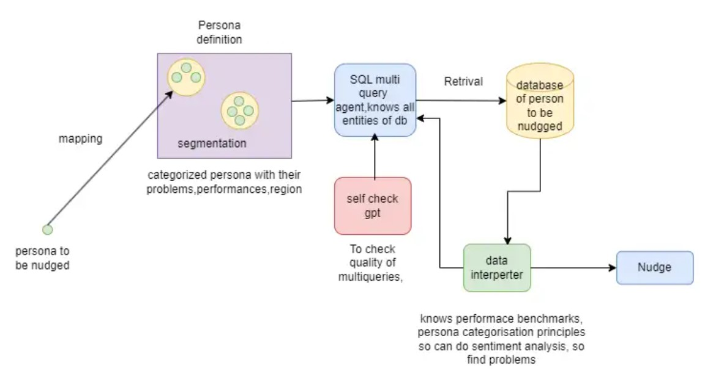

# Automated Personalized Nudge Pushing System

## Table of Contents

- [About the Project](#about-the-project)
- [Installation](#installation)
- [Usage](#usage)
- [License](#license)
- [Contact](#contact)

---

## About the Project


Problem Solved

### Built With

- [Autogen MultiAgent Framework](https://microsoft.github.io/autogen/docs/Use-Cases/agent_chat/)
- [Langchain](https://www.langchain.com/)
- [Northwind_Database](https://github.com/Microsoft/sql-server-samples/tree/master/samples/databases/northwind-pubs)

---

## Installation

To install and run this project locally, follow these steps:

1. Clone the repo:
    ```bash
    git clone https://github.com/agrawalsnehal327/Decision_point_Analytics.git
    ```

2. Install dependencies:
    ```bash
    pip install -r requirements.txt
    ```

---

## Usage

Explain how to use your project. Include code snippets or instructions for running the app.

```bash
# Example command
npm run example
